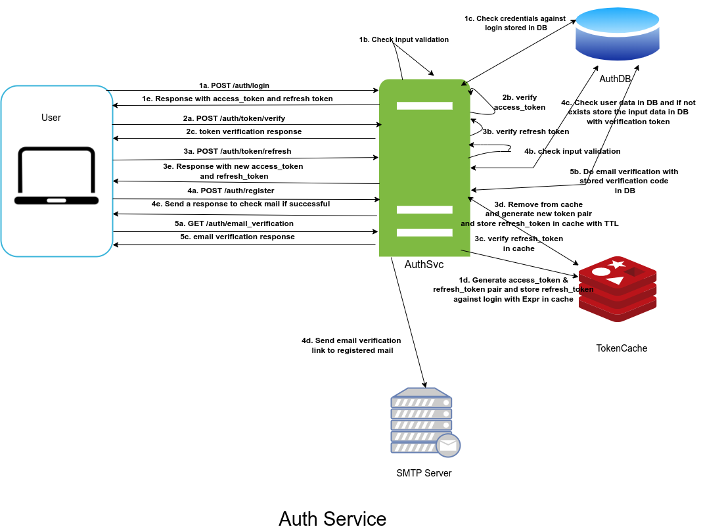

# [Auth-Service](./authsvc)

An User **Auth**entication **Service** that will allow users to Login via Email/Phone and Password combination and receive a short lived Access Token that will allow them to access some authenticated routes in other services (these services are out of scope of this project but think about the use cases).

## Outline

- [Auth-Service](#auth-service)
  - [Outline](#outline)
    - [Features to be implemented](#features-to-be-implemented)
    - [Service Diagram](#service-diagram)
    - [Run Instructions](#run-instructions)
      - [Dockerize services running ports](#dockerize-services-running-ports)
    - [Postman collection and Endpoints](#postman-collection-and-endpoints)
    - [Pre-populated data](#pre-populated-data)
      - [Users](#users)
      - [Roles and permissions](#roles-and-permissions)

### Features to be implemented

1. **Registration** - optional, can go with already populated Users in DB. If you decide to go for it, mock any verification process ex. Email/Phone Verification
2. **Login**
3. **Access & Refresh Tokens** - upon successful login User will receive an Access Token(short lived) and a Refresh Token(relatively long lived, can be used to avoid forcing the user to login each time an Access Token expires).
4. **JWT tokens** are preferable.
5. **Verify Token** - endpoint to verify an Access Token. Verified Access token will return the User's profile, role, permission etc.
6. **New Access Token** -  endpoint to acquire a new Access Token using the Refresh Token generated upon Login.

### Service Diagram

### Run Instructions

- To spin up _**run**_ `docker-compose up --build`.
  >
  > - AuthSvc will be running on <https://localhost:8080> after docker-compose up
  > - [Mailhog][3] mock mail server's web UI will be running on <http://localhost:8025>
  >
- To tear down _**run**_ `docker-compose down -v`

#### Dockerize services running ports

| Service | Type | Docker Port | Host Port |
|--------|-------|------------|------------|
| **authsvc** | [**Web**](https://localhost:8080) | **8080** | **8080** |
| **authdb** | **Database** | **3306** | **3320** |
| **tokencache** | **Cache** | **6379** | **3321** |
| **smtpmock**   | **Mail Server** | **1025** | **1025** |
| **smtpmock**   | [**Web UI**](http://localhost:8025)      | **8025** | **8025**

### Postman collection and Endpoints

Import the url (<https://www.getpostman.com/collections/f4dc6a39771cb8945120>) into Postman to get the API collection. Please follow the [link][1] to know more.

Check the endpoints [here][2]

### Pre-populated data

Following Users, Roles and their permissions will be added to AuthDB on `docker-compose up`

#### Users

No|Email                        |Password                           | Roles           |
--|-----------------------------|-----------------------------------|-----------------|
01|<admin.user@testmail.com>    |_LaRa08CRoft                       |  _Admin_        |
02|<author.user1@testmail.com>  |_GOllum#!                          |  _Author_       |
03|<reader.user1@testmail.com>  |bUfo_MelanOst!ktus                 |  _Reader_       |

#### Roles and permissions

No|Roles                        |Permissions                                                      |
--|-----------------------------|-----------------------------------------------------------------|
01|_Admin_                      | _**GetPost**_, _**AddPost**_, _**UpdatePost**_, _**DeletePost**_|
02|_Author_                     |_**GetPost**_, _**AddPost**_, _**UpdatePost**_                   |
03|_Reader_                     |_**GetPost**_                                                    |

[3]: https://github.com/mailhog/MailHog
[2]: https://github.com/ParthoShuvo/auth-system/tree/master/authsvc#postman-collection
[1]: https://learning.postman.com/docs/getting-started/importing-and-exporting-data/#:~:text=to%20import%20your%20api%20specifications%20into%20postman%3A
